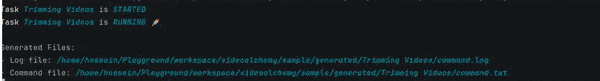

# VideoAlchemy: Simplified, Structured Video Processing

Welcome to **VideoAlchemy**, an advanced toolkit that offers a more readable and structured way to handle video processing tasks compared to traditional FFmpeg commands. VideoAlchemy enables users to define video processing workflows using a simple YAML-based configuration, enriched with built-in validation to minimize errors and streamline command execution.

Whether you're processing a single video or executing a sequence of commands, VideoAlchemy ensures a smoother and more intuitive experience.




## Table of Contents

- [Introduction](#introduction)
- [Why VideoAlchemy?](#why-videoalchemy)
- [Getting Started](#getting-started)
  - [Installation](#installation)
  - [Run VideoAlchemy](#run-videoalchemy)
- [VideoAlchemy Docs](https://viddotech.github.io/videoalchemy/)
- [Blog Posts](#blog-posts)
- [Contributing](#contributing)
- [Upcoming Enhancements and Support](#upcoming-enhancements-and-support)
- [License](#license)


## Introduction

**VideoAlchemy** provides a user-friendly alternative to directly writing complex FFmpeg commands. With a focus on clarity, ease of use, and sequence management, VideoAlchemy allows you to write video processing tasks using readable YAML files. These files come with built-in validation to help avoid common mistakes, making it ideal for both beginners and seasoned professionals.

## Why VideoAlchemy?

VideoAlchemy enhances video processing in several ways:

1. **Readable Attributes**: VideoAlchemy transforms the complexity of FFmpeg command-line syntax into a clear, structured format using YAML attributes. This reduces the chance of errors and improves the legibility of the command.

2. **Rich YAML Validation**: The `viddo-compose.yaml` file provides real-time validation, helping you craft correct FFmpeg commands by offering clear syntax and error-checking mechanisms. Common FFmpeg pitfalls are automatically mitigated, resulting in smoother workflows.

3. **Command Sequencing**: Need to run multiple FFmpeg commands in sequence? VideoAlchemy makes this simple by allowing you to chain commands and set dependencies between tasks within the YAML file. This is especially useful for projects requiring multiple steps, like video conversion followed by audio extraction.

## Getting Started

videoalchemy currently supports Linux and macOS. Windows support is coming soon.

### Installation

```bash
version=$(curl -s https://api.github.com/repos/viddotech/videoalchemy/releases/latest | grep -oP '"tag_name": "\K(.*)(?=")') && curl -o setup.sh "https://raw.githubusercontent.com/viddotech/videoalchemy/main/scripts/setup.sh" && chmod +x setup.sh && sudo ./setup.sh "$version" && rm -rf setup.sh
```

### Run VideoAlchemy

```bash
videoalchemy compose -f viddo-compose.yaml
```

### Example `viddo-compose.yaml` File

```yaml
version: 1  # Schema version of viddo-compose

generate_path: "./generated"  # Directory of log and command files

tasks:  
  - name: Convert to AVI  
    command: ffmpeg  
    inputs:  
      - id: input_video  
        source: 'input.mp4'  
    outputs:  
      - id: output_avi  
        source: 'output.avi'  
        overwrite: true  

  - name: Extract Audio  
    command: ffmpeg  
    inputs:  
      - id: output_avi  
        output_id: output_avi  # Reference from the previous task  
    codecs:  
      - codec_name:
          audio: copy  
        video_none: true
    run_after:
      - Convert to AVI
    outputs:  
      - id: audio_only  
        source: 'output_audio.mp3'  
        overwrite: true  
```

### Key Features:

- **Readable and Organized**: Rather than memorizing FFmpeg's complex flags and options, you can clearly define inputs, outputs, codecs, and filters in an intuitive format.
- **Command Sequencing**: Define dependencies between tasks using `run_after` to ensure commands run in the desired order.
- **Error Prevention**: YAML validation ensures that FFmpeg commands are properly formed, helping to avoid errors early in the workflow.

### Blog Posts

- [Creating Multi-Bitrate HLS Videos with VideoAlchemy](https://medium.com/@hsn.gerami/creating-multi-bitrate-hls-videos-with-videoalchemy-59e3e67d6a27)
- [Add a Watermark to a Video Using VideoAlchemy](https://dev.to/hsngerami/add-a-watermark-to-a-video-using-videoalchemy-3hlc)

## Contributing

We welcome contributions from the community to make VideoAlchemy better! Here's how you can get involved:

- **Improve Readability**: Suggest improvements to the way we structure attributes for video processing.
- **Expand Validation**: Help us enhance our YAML validation to cover more complex FFmpeg use cases.
- **Create New Commands**: Propose and implement new commands and workflows.


## Upcoming Enhancements and Support

We are continuously working to enhance VideoAlchemy. Here are some exciting features we plan to introduce in the future:


1. **Integration with AI Models/Services**: Leverage AI models and services to offer advanced features like automatic video enhancement, noise reduction, and smart video editing, empowering users with AI-powered video processing tools.

2. **Toolkit for Streamers and YouTubers**: VideoAlchemy will further evolve into an indispensable toolkit tailored for streamers and content creators, offering specialized features such as custom overlays, real-time streaming enhancements, and optimized video formats for platforms like Twitch and YouTube.

3. **Extract FFMPEG Logs for Monitoring**: Implement a system to extract and visualize FFmpeg logs in real-time, enabling users to monitor and troubleshoot their video processing tasks through a detailed log dashboard.

4. **Complete Support for FFmpeg Parameters**: Expand the YAML schema to support all FFmpeg parameters, ensuring users have access to FFmpeg’s full range of options while maintaining VideoAlchemy’s simplified interface. This will be accompanied by comprehensive documentation, providing detailed guidance on each parameter.

5. **Cloud Storage Integration**: Add support for various cloud storage solutions such as Azure Storage, AWS S3, Minio, and more, allowing users to specify these as source files for their video processing tasks.

6. **Improved Validation**: Enhance the built-in validation mechanisms to cover more complex scenarios and edge cases, ensuring that all FFmpeg commands are correctly formed and executed without errors.

---

Your support keeps this project growing. Consider donating to help us continue developing VideoAlchemy.

- [Bitcoin (BTC)](docs/donate.md)
- [Ethereum (ETH)](docs/donate.md)

## License

VideoAlchemy is licensed under the [MIT License](LICENSE). Contributions are licensed under the same terms.

